# Android: Material design@geekbrains (https://gb.ru/go/aPWYkD)
## Lesson1: intro
new app: nasa: using https://api.nasa.gov with retrofit retrive data: picture of the day 
text is shown in BottomSheet

### Preview
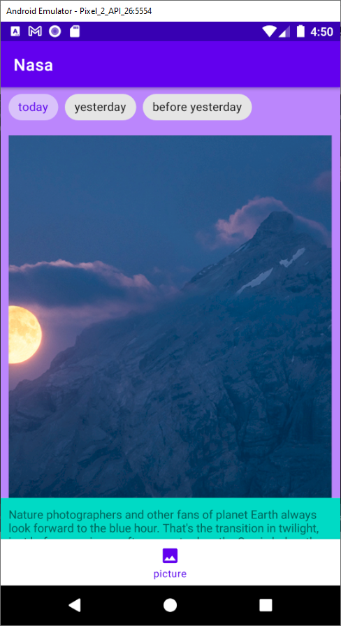
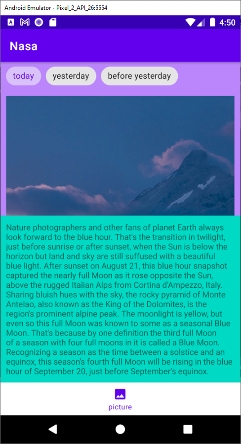

## Lesson2: styles
app changes: added styles and themes, settings fragment where you can pick a theme and change to dark mode (from Android 10+ dark is default), added custom font for description

### Preview
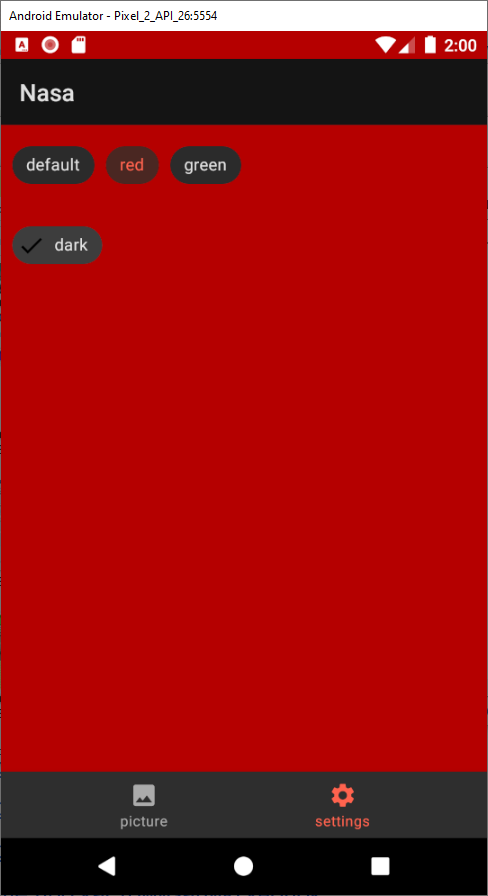
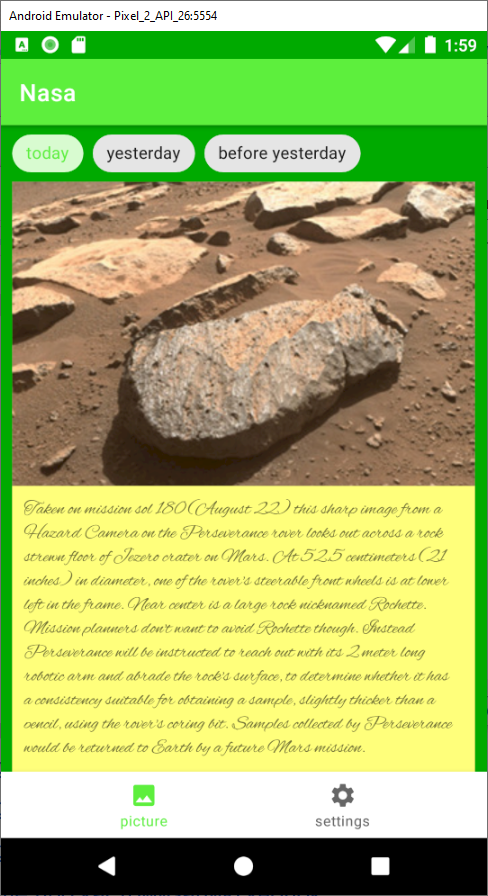

## Lesson3: ViewPager
app changes: more data from Nasa.Api placed on ViewPager with different orientation, badges and basic transformer; youtube call was added for a video link on POD; 

### Preview
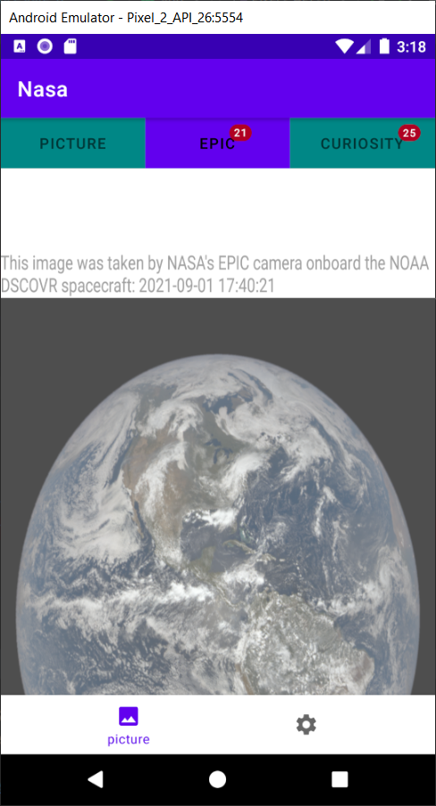
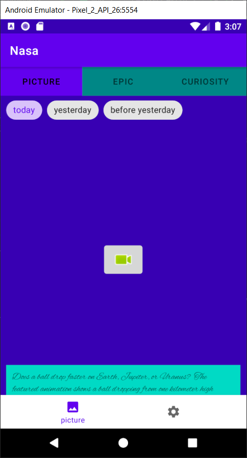

## Lesson4: Constraint&Motion Layouts
app changes: added constraint-sandbox with demonstation of border, constraintCircle and collapsingToolbar; and motionLayout with animation 

### Preview
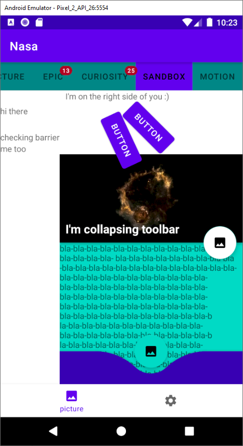
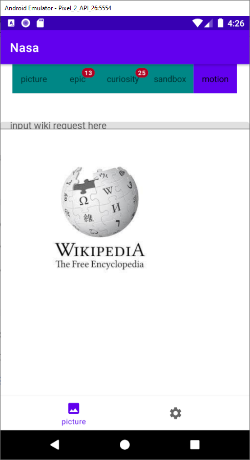
<video src="printscreens/lesson4.mp4" width="32%"></video>

## Lesson5: Animation
app changes: added recyclerView with sharedElement-animation on item click; transition-animation on image click (zoomin/out)

### Preview

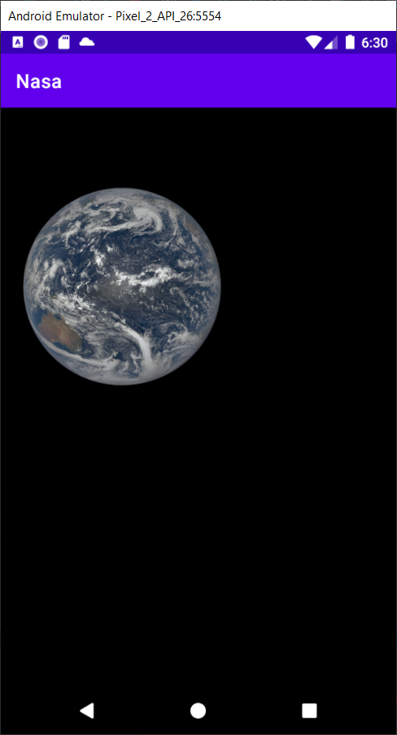
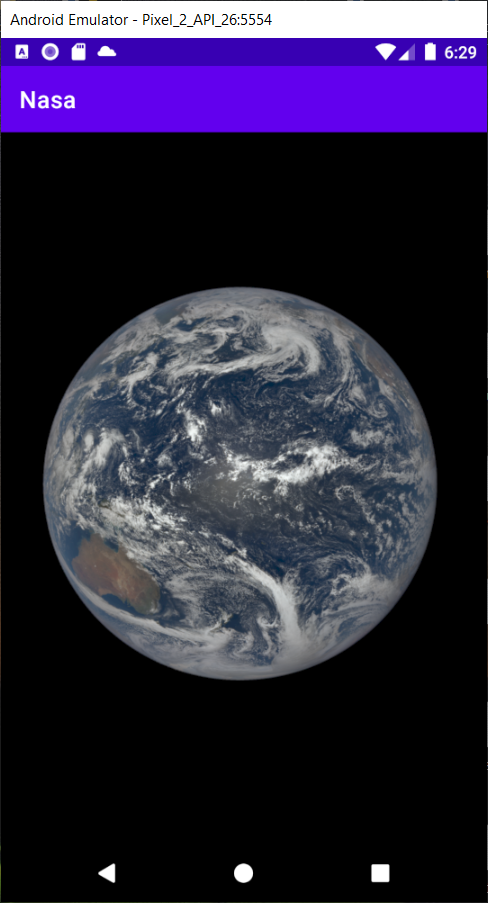
<video src="printscreens/lesson5.mp4" width="32%"></video>

## Lesson7: Texts
app changes: downloadable font on Curiosity page, and Spannable on PictureOfTheDay page

### Preview
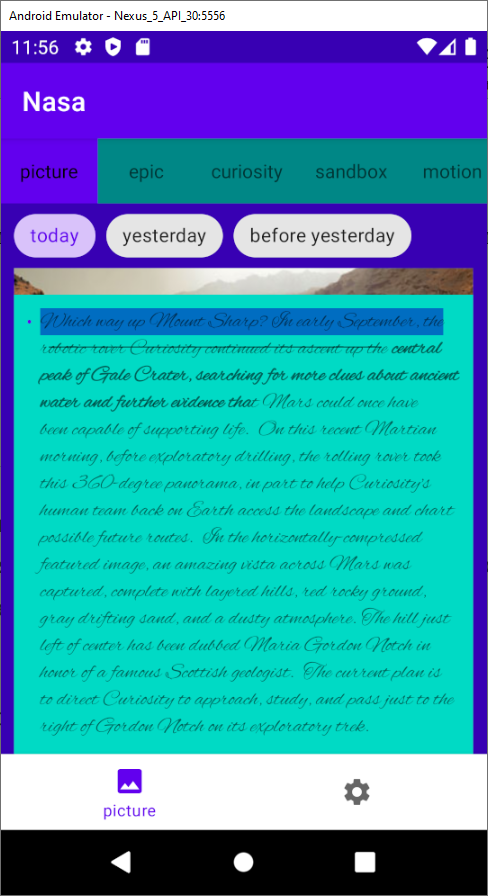

## Lesson8: Splash screen
app changes: added splash screen  for 3 seconds

### Preview
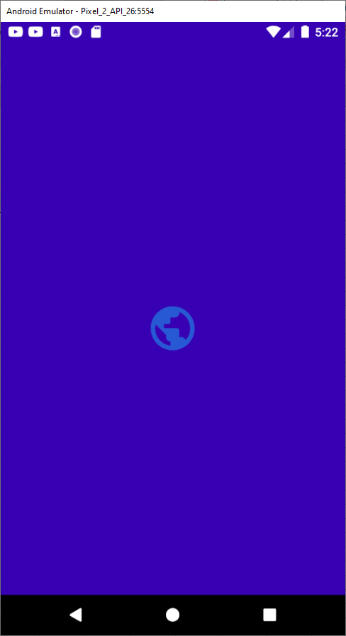
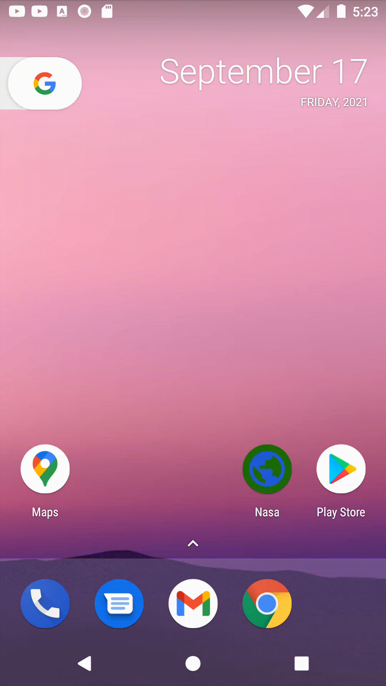

